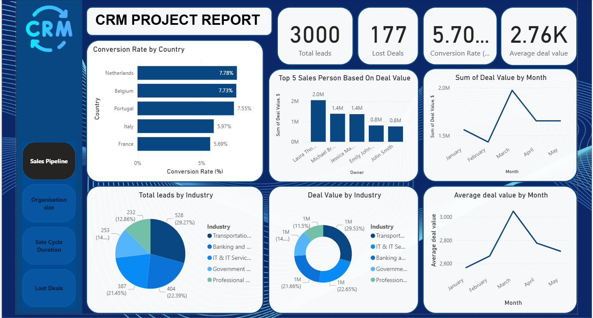

# Hi, i am M RAJA
Data Analyst | B. Com in Finance |Diploma in Indian and Foreign Accounting |Power BI | SQL | Python | Tableau

## About Me
I'm an analytical and detail-oriented Data Analyst with a strong foundation in finance and accounting.
Skilled in Power BI, SQL, Advanced Excel, and Tableau, I create interactive dashboards, streamline reporting processes, and deliver data-driven solutions.
Certified in Indian & Foreign Accounting with knowledge of GAAP, IFRS, and taxation compliance, I specialize in bridging business intelligence with financial insights.
🚀 Passionate about turning raw data into actionable strategies for business growth!

## Education

Bachelor of Commerce (B. Com), Finance
Kerala University (2021 – 2024)

Diploma in Indian & Foreign Accounting
The Institute of Accountants & Book-Keepers (2023 – 2024)

## Projects
🔹 CRM Sales Dashboard – [Power BI | Rows & Columns]

📊 Built an interactive dashboard for sales performance tracking & pipeline management.
⚡ Applied DAX calculations to measure KPIs and automate reporting (reduced manual work by 40%).
📈 Designed data models and calculated columns for trend & performance analysis.

🔹 Email Marketing Analytics Dashboard – [Power BI | Rows & Columns]

📩 Developed a comprehensive dashboard to analyze email campaign performance (CTR, bounce, unsubscribe, conversions).
🎯 Identified top-performing campaigns & customer segments using interactive filters.
🌍 Conducted geographic engagement analysis to optimize campaign strategies.
![Dashboard]

## Certifications

✅ Certified Data Analyst (Power BI, SQL, Tableau, Advanced Excel)

✅ Tally Essential Comprehensive Certification – Tally Education Pvt. Ltd.

📊 Diploma in Indian & Foreign Accounting (Finance, GAAP, IFRS, Taxation)

## Tools & Skills
Power BI | SQL | Python | Tableau | Excel 
Communication | Teamwork | Problem-Solving | Adaptability
Tally Prime | QuickBooks | MS Office Suite

## Interests

📊 Business Dashboard Design

📈 Finance & Business Intelligence

⚽ Data Analytics

## 📫 Contact Details  
*Let’s connect and see how we can make a difference together!*  

<table>
  <tbody>
    <tr>
      <td>📧</td>
      <td><a href="mailto:rajamadhu0303@gmail.com">rajamadhu0303@gmail.com</a></td>
    </tr>
    <tr>
      <td>📞</td>
      <td>(+91) 949-706-8999</td>
    </tr>
    <tr>
      <td>📍</td>
      <td>Kayamkulam, Alappuzha, Kerala</td>
    </tr>
    <tr>
      <td>⬇️</td>
      <td><a href=""https://M_Raja_Resume.pdf/"">Download my CV</a></td>
    </tr>
    <tr>
      <td>🌐</td>
      <td><a href="https://www.linkedin.com/in/raja-m-034002375">Let’s connect on LinkedIn</a></td>
    </tr>
  </tbody>
</table>

